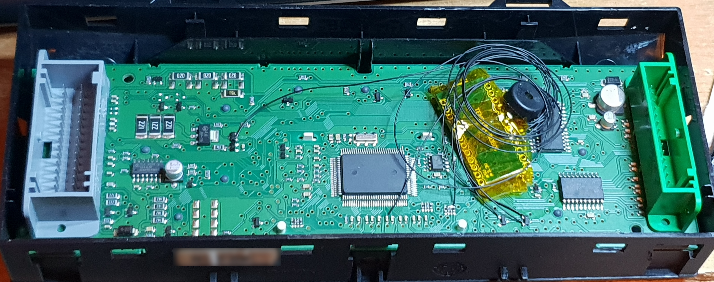

# Hack Renault Symbol Car AC to never turn off air recirculation

The Renault Symbol often turns off air recirculation automatically
after a while, even if I want to keep it on continuously.

This is a small project using a Pro Micro, that allows me to
simulate automatically pressing the recirculation button again,
when the car decides to automatically disable it.

This project probably functions on some other cars as well as long
as they have the following control unit:

The label has the following number, which is probably a part number: `8200531471`
Also the following identifiers appear: `VE 69530006` , and `VTH N103904R`

# BOM
- 1 Pro Micro
- 6 wires ( 3 going to observe led states, 1 going to observe and simulate press, 2 for ground and power)
- 1 Piezo Buzzer (optional)

# Here you can see more precisely the locations where the wires were soldered to on the backside:

# This is how it looks like with the hack applied on the backside:

Unfortunately I have not documented exactly which wire goes where, but it shouldn't be too hard to recreate.
If I will open it back up for any reason I will add more info here.
Also if you recreate this, feel free to send a PR to improve it.
